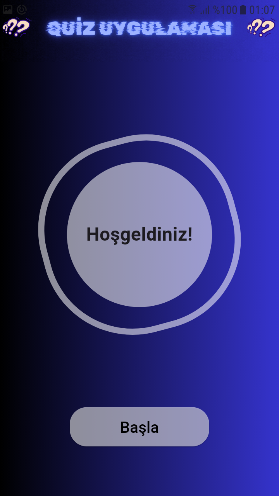
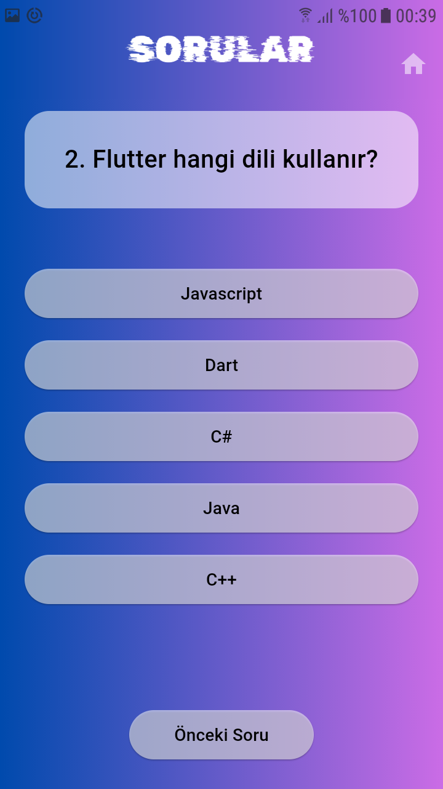
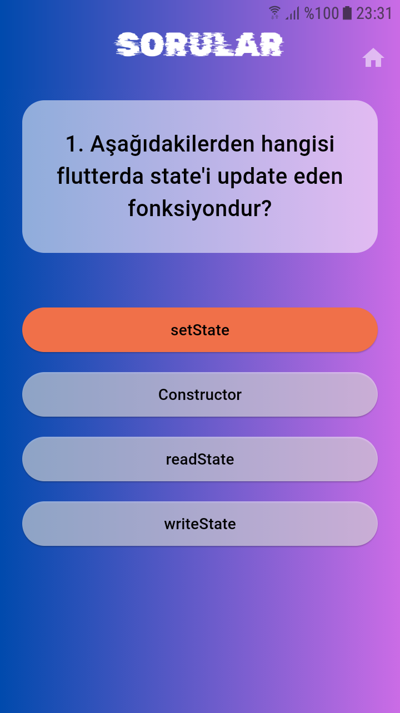
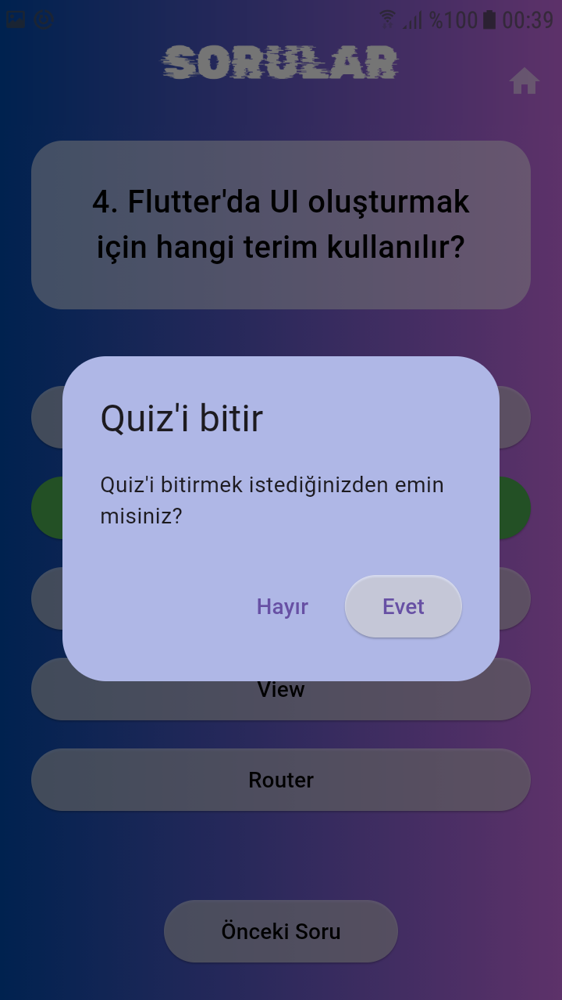
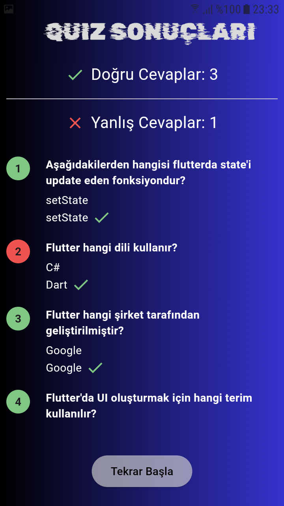

# Quiz App

  

 
Bu proje, kullanıcıların sorulara cevap vererek doğru ve yanlış cevaplarını görebileceği bir Quiz Uygulamasıdır. Uygulama, Flutter kullanılarak geliştirilmiştir ve özelleştirilebilir bir yapıya sahiptir.

 
## Özellikler

- Doğru ve Yanlış Cevap Sayacı: Kullanıcının doğru ve yanlış cevapları otomatik olarak hesaplanır.
- Sonuç Özeti: Her bir soru için doğru cevap ve kullanıcının cevabı gösterilir.
- Başlangıca Dönüş: Sonuç sayfasından tekrar başlangıç ekranına dönme imkanı.
- Responsive Tasarım: Tüm cihazlarda düzgün bir şekilde çalışır.

## Kullanılan Teknolojiler

- Flutter: Ana framework.
- Dart: Programlama dili.
- Material Design: Kullanıcı arayüzü tasarımı.

## Ekran Görüntüleri

    
 

## Kullanım

- Kullanıcı, bir soruya cevap verdikten sonra otomatik olarak bir sonraki soruya geçer. Tüm sorular cevaplandıktan sonra sonuç sayfasına yönlendirilir.
- Bir önceki soruya dönüp cevabı değiştirme imkanı verir.
- Sonuç sayfasında doğru ve yanlış cevap sayısı gösterilir.
- Tüm soruların detayları; soru, doğru cevap ve kullanıcının verdiği cevap yine sonuç sayfasında gösterilir.
- Sonuç ekranındaki "Tekrar Başla" butonuna tıklayarak quiz yeniden başlatılır.

